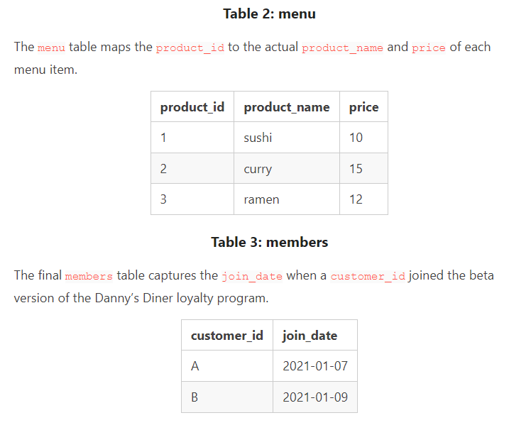

# Case Study #1 - Danny's Diner

## Introduction
Danny's strong passion for Japanese cuisine led him to venture into the restaurant business early in 2021. He courageously established a charming eatery specializing in his top three dishes: sushi, curry, and ramen. In this endeavor, Danny's Diner has accumulated fundamental operational data during its initial months. However, as a data analyst, I'm now sought to assist the restaurant in leveraging this data to optimize its operations and ensure its sustainability. The challenge lies in transforming this raw data into actionable insights that can guide decision-making and ultimately contribute to the success of Danny's Diner.

## Problem Statement
Danny wants to use the data to answer a few simple questions about his customers, especially about their visiting patterns, how much money they’ve spent and also which menu items are their favourite. Having this deeper connection with his customers will help him deliver a better and more personalised experience for his loyal customers.
He plans on using these insights to help him decide whether he should expand the existing customer loyalty program - additionally, he needs help to generate some basic datasets so his team can easily inspect the data without needing to use SQL.
Danny has provided you with a sample of his overall customer data due to privacy issues - but he hopes that these examples are enough for you to write fully functioning SQL queries to help him answer his questions!

Danny has shared with you 3 key datasets for this case study:
- sales
- menu
- members 

## Entity Relationship Diagram
  

  

### Case Study Questions

1.  What is the total amount each customer spent at the restaurant?
2.  How many days has each customer visited the restaurant?
3.  What was the first item from the menu purchased by each customer?
4.  What is the most purchased item on the menu and how many times was it purchased by all customers?
5.  Which item was the most popular for each customer?
6.  Which item was purchased first by the customer after they became a member?
7.  Which item was purchased just before the customer became a member?
8.  What are the total items and amount spent for each member before they became a member?
9.  If each $1 spent equates to 10 points and sushi has a 2x points multiplier - how many points would each customer have?
10.  In the first week after a customer joins the program (including their join date) they earn 2x points on all items, not just sushi - how many points do customers A and B have at the end of January?

click [here](https://github.com/protechanalysis/Danny-Ma-SQL-Diner-Case-Study/blob/main/Danny's%20Diner) for query.

This case study assesses my proficiency in Common Table Expressions, applying Group By aggregates, utilizing Window Functions for ranking purposes, and effectively employing Table Joins.
