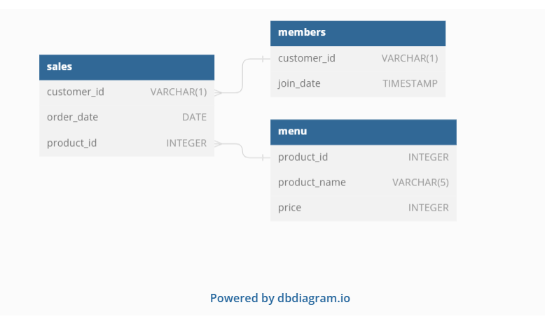
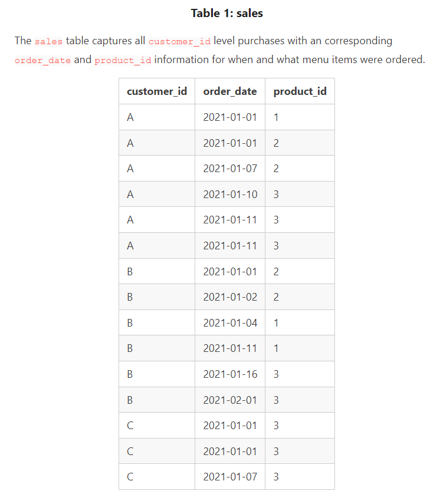

# <p align="center" style="margin-top: 0px;"> 🥘 Case Study #1 - Danny's Diner 🥘


**This repository hosts the solutions for Week 1 of the 8 Weeks SQL challenge by DannyMa.**

## Introduction
Danny's strong passion for Japanese cuisine led him to venture into the restaurant business early in 2021. He courageously established a charming eatery specializing in his top three dishes: sushi, curry, and ramen. In this endeavour, Danny's Diner has accumulated fundamental operational data during its initial months. However, as a data analyst, I'm now sought to assist the restaurant in leveraging this data to optimize its operations and ensure its sustainability. The challenge lies in transforming this raw data into actionable insights that can guide decision-making and ultimately contribute to the success of Danny's Diner.

## Problem Statement
Danny wants to use the data to answer a few simple questions about his customers, especially about their visiting patterns, how much money they’ve spent and also which menu items are their favourite. Having this deeper connection with his customers will help him deliver a better and more personalised experience for his loyal customers.
He plans on using these insights to help him decide whether he should expand the existing customer loyalty program - additionally, he needs help to generate some basic datasets so his team can easily inspect the data without needing to use SQL.
Danny has provided you with a sample of his overall customer data due to privacy issues - but he hopes that these examples are enough for you to write fully functioning SQL queries to help him answer his questions!

Danny has shared with you 3 key datasets for this case study:
- sales
- menu
- members 

## Entity Relationship Diagram
For all datasets and relations that exist in the database schema.

<details>
<summary>Click to show</summary>






</details>

### Case Study Questions and Solutions


1.  What is the total amount each customer spent at the restaurant?
  <details>
    <summary>Click to show SQL query</summary>

```sql
select s.customer_id, SUM(m.price) AS total_amount_spent
from dannys_diner.sales as s
inner join dannys_diner.menu as m using(product_id)
group by s.customer_id
order by total_amount_spent desc;
```
</details>

2.  How many days has each customer visited the restaurant?
  <details>
<summary>Click to show SQL query</summary>

```sql
select 
    customer_id,	
    count(distinct order_date) as num_days_visited
from dannys_diner.sales
group by customer_id
order by num_days_visited desc;
```
</details>

3.  What was the first item from the menu purchased by each customer?
<details>
<summary>Click to show SQL query</summary>

```sql
with first_order as (
	select customer_id,
	       product_name,
	       rank() over(partition by customer_id order by order_date) as ranking
  from
	     dannys_diner.sales
  inner join dannys_diner.menu
	     using(product_id))
select customer_id,
		product_name
from first_order
where ranking = 1;
```
</details>

4.  What is the most purchased item on the menu and how many times was it purchased by all customers?
 <details>
<summary>Click to show SQL query</summary>

```sql
select 
    product_name,	
    count(*) as num_purchase
from 
    dannys_diner.menu
inner join dannys_diner.sales	
    using(product_id)
group by product_name
order by num_purchase desc
limit 1;
```
</details>

5.  Which item was the most popular for each customer?
 <details>
<summary>Click to show SQL query</summary>

```sql
with common as (
	select customer_id, product_name, product_id, count(*) as num_order,
	       row_number() over(partition by customer_id order by count(*) desc) as rank
        from 
               dannys_diner.sales
        inner join dannys_diner.menu
	      using(product_id)
        group by customer_id, product_name, product_id)
select customer_id, product_name, num_order
from common 
where rank = 1;
```
</details>

6.  Which item was purchased first by the customer after they became a member?
 <details>
<summary>Click to show SQL query</summary>

```sql
select
    s.customer_id,
    m.product_name AS first_item_after_membership
from
    (
        select
            s.customer_id,
            MIN(s.order_date) as first_order_date_after_membership
        from
            dannys_diner.sales as s
        inner join
            dannys_diner.members AS m
            on s.customer_id = m.customer_id
            and s.order_date > m.join_date
        group by
            s.customer_id
    ) as sub
inner join
    dannys_diner.sales as s
    on sub.customer_id = s.customer_id
    and sub.first_order_date_after_membership = s.order_date
inner join
    dannys_diner.menu as m
    using(product_id);
```
</details>

7.  Which item was purchased just before the customer became a member?
 <details>
<summary>Click to show SQL query</summary>

```sql
select
    s.customer_id,
    m.product_name as item_before_membership
from
    (
        select
            s.customer_id,
            max(s.order_date) as order_date_before_membership
        from
            dannys_diner.sales as s
        inner join
            dannys_diner.members as m
            on s.customer_id = m.customer_id
            and m.join_date > s.order_date 
        group by
            s.customer_id
    ) as sub
inner join
    dannys_diner.sales as s
    on sub.customer_id = s.customer_id
    and sub.order_date_before_membership = s.order_date
inner join
    dannys_diner.menu as m
    using(product_id);

```
</details>

8.  What are the total items and amount spent for each member before they became a member?
 <details>
<summary>Click to show SQL query</summary>

```sql
select customer_id, sum(num_order) as total_order, sum(amount) as total_amount
from (
		select
    		num.customer_id,
    		num.num_order,
    		(num.num_order * m.price) as amount
		from (
        		select
           			s.customer_id,
            		s.product_id,
            		count(*) as num_order
        		from
            		dannys_diner.sales as s
        		inner join
            		dannys_diner.members as m
            	using (customer_id)
        		where
                    s.order_date < m.join_date
        		group by
            		s.customer_id,
                    s.product_id
                ) as num
		inner join
    		dannys_diner.menu as m
    	using (product_id)) as t
group by customer_id;
```
</details>

9.  If each $1 spent equates to 10 points and sushi has a 2x points multiplier - how many points would each customer have?
 <details>
<summary>Click to show SQL query</summary>

```sql
select customer_id,
    sum(case 
        	when product_name = 'sushi' then (price*10*2)
        	else (price*10)
    	end) as points
from dannys_diner.sales
inner join dannys_diner.menu
using(product_id)
group by customer_id;
```
</details>

10.  In the first week after a customer joins the program (including their join date) they earn 2x points on all items, not just sushi - how many points do customers A and B have at the end of January?
 <details>
<summary>Click to show SQL query</summary>

```sql
select 
    s.customer_id,
    sum(
        case
            when s.order_date between m.join_date and m.join_date + interval '6' day then price * 10 * 2
            when s.order_date not between m.join_date and m.join_date + interval '6' day and h.product_name = 'sushi' then price * 10 * 2
            when h.product_name = 'sushi' then price * 10 * 2 
            else price * 10
        end
    ) as total_point
from 
    dannys_diner.sales as s
inner join
    dannys_diner.menu as h
    using (product_id)
left join
    dannys_diner.members as m
    using (customer_id)
where s.customer_id in (select customer_id from dannys_diner.members) and extract(month from s.order_date) = 1
group by customer_id
order by customer_id;
```
</details>


click [here](https://github.com/protechanalysis/Danny-Ma-SQL-Diner-Case-Study/blob/main/Danny's%20Diner) for full query.

This case study assesses my proficiency in Common Table Expressions, applying Group By aggregates, utilizing Window Functions for ranking purposes, and effectively employing Table Joins. :smile:
